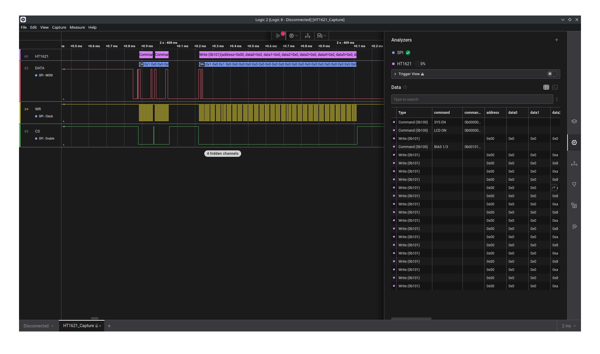

# HT1621 (SPI)
High Level Analyzer for HT1621 LCD Driver on SPI bus with Saleae Logic analyzer

## SPI settings
- Significant Bit: `MSB`
- Bits per Transfer: `1`
- Clock State: `CPOL = 1`
- Clock Phase: `CPHA = 1`
- Enable Line: `Active Low`

- MOSI = "DATA" 
- CLK  = "WR" (Only single direction is supported)
- CS   = "CS"

## References
- Generated using [HT1621 Datasheet v3.60](https://www.holtek.com/page/vg/ht1621)
